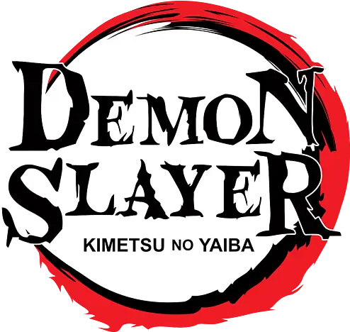
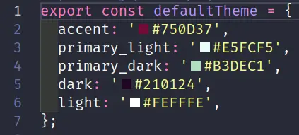
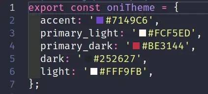
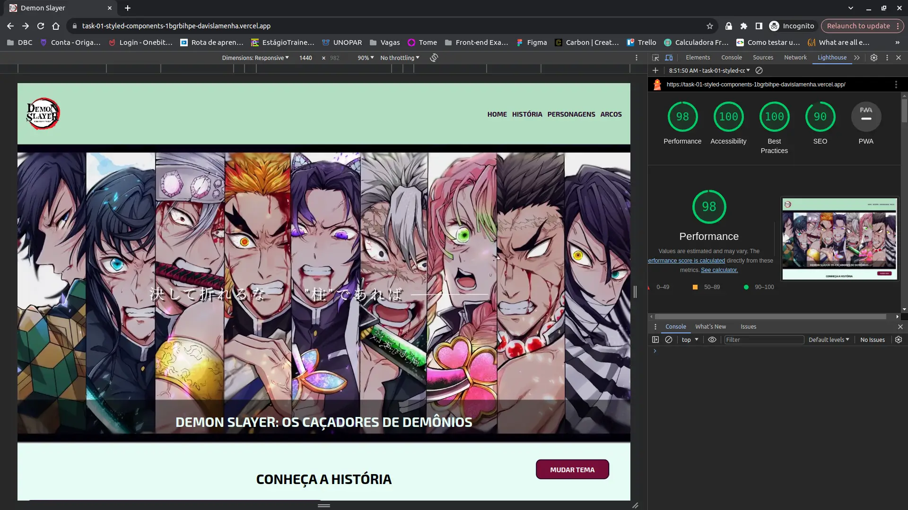

<div align="center">
<p>

</p>

[Clique aqui para visualizar o site](https://task-01-styled-components.vercel.app/)

<br>

</div>
***

## Índice

- [1. Prefácio](#1-prefácio)
- [2. Orientações para a Tarefa](#2-orientações-para-a-tarefa)
- [3. Metodologia](#3-metodologia)
- [4. Detalhamento](#4-detalhamento)
- [5. Instruções para acessar o projeto](#5-instruções-para-acessar-o-projeto)
- [6. Tecnologias utilizadas](#6-tecnologias-utilizadas)
- [7. Resultados do Lighthouse](#7-resultados-do-lighthouse)
- [8. Desenvolvedores](#8-desenvolvedores)

---

## 1. Prefácio

Atividade desenvolvida para o programa de estágio Vem Ser da empresa DBC Company - turma 13, que tem como objetivo desenvolver as nossas habilidades com o _React_ e _StyledComponents_ integrando o conhecimento adquirido em aula.

---

## 2. Orientações para a Tarefa

Desenvolver uma aplicação que contenha temas dinâmicos, ou seja, a aplicação deve conter mais de um tema e por meio de alguma ação este tema ser alterado.

### Requisitos da tarefa:

- [x] Escolher um tema
- [x] Todo e qualquer recurso de estilização deve ser feito por meio do _StyledComponents_
- [x] Fazer somente com _React_
- [x] Boa utilização dos recursos vistos em aula do _StyledComponents_
- [x] Boa Definição, consumo e planejamento de temas dinâmicos
- [x] Organização dos arquivos do projeto
- [x] _Deploy_ no _Vercel_

---

## 3. Metodologia

- Realizamos reuniões pelo _Discord_ para definir o fluxo de trabalho (_git flow_ e dividir as tarefas).
- Trabalhamos no mesmo repositório _codando_ em _branchs_ com nomes semânticos, sendo permitido somente abrir _pull request_ para a _branch develop_, após a tarefa conluída foi aberta a _pull request_ para a _branch main_;
- Para o código foi adotado criação de classes e _commites_ em inglês;
- Pesquisa de _Ui Design_ para escolher as paletas relacionadas aos temas;
- Verificamos os níveis de acessibilidade e SEO pela ferramenta _Lighthouse_;

---

## 4. Detalhamento

#### Tema Hashira (Padrão)



#### Tema Oni



---

## 5. Instruções para acessar o projeto

Este projeto tem como requisito o _deploy_ pelo _Vercel_, portando pode ser visualizado [clicando aqui](https://task-01-styled-components.vercel.app/)

1 - Clone o projeto

```bash
git clone git@github.com:davislamenha/task-01-styled-components.git
```

2 - Instale as depêndencias

```bash
npm i
```

3 - Inicie o projeto

```bash
npm run dev
```

---

## 6. Tecnologias utilizadas

<div>
<br>


</div>

<br>

---

## 7. Resultados do Lighthouse



---

### 8. Desenvolvedores

#### Davis Sampaio <br>

[Github](https://github.com/davislamenha)

#### Clara Maestri <br>

[Github](https://github.com/vivalaclara)
<br>

---
